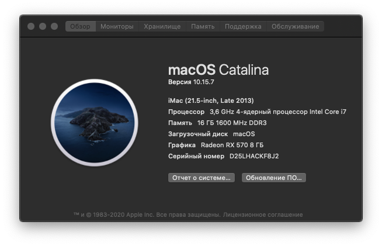
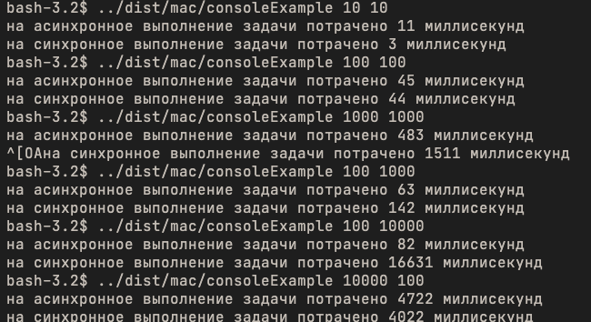

# Многопоточность на C#
Код лабораторной делает следующее:
* вычисляет квадраты от 1 до введенного числа
* создает файлы в количестве от 1 до введенного числа в синхронном и асинхронном режиме
* выводит в консоль результат скорости выполнения задачи в синхронном и асинхронном режиме.

Исходный код программы написан на языке C#, затем скомпилирован с помощью .NET Core 3.1.
Благодаря кроссплатформенности фреймворка .NET, исходный код был скомпилирован в бинарый файл для 3-х операционных систем: Windows, Mac, Linux (Debian).

Исходные файлы находится в папке src.
Скомпилированная программа находится в папке dist.

Для запуска исходника в режиме разработки необходимо:
* установить [SDK](https://dotnet.microsoft.com/download/dotnet-core/thank-you/sdk-3.1.404-windows-x64-installer)
* в термнале выполнить команду
    ```sh
    dotnet run [аргумент1 аругемент2]
    ```

Запустить программу можно без установки runtime, так как при компиляции runtime был уже включен в сборку.

Для запуска программы в операционной системе Windows необходимо из командной строки (cmd.exe) выполнить
```
dist/win/ConsoleExample.exe [аргумент1 аругемент2]
```
Аналогичным образом программу можно запустить из других ОС.

* Аргумент1 - количество файлов
* Аргумент2 - количество квадратов чисел


## Результаты выполнений
### Характеристики компьютера
<center>

</center>


### Вывод программы
<center>

</center>

### Вывод
Как видно из результатов, при маленьких задачах, когда требуется создать 10 файлов с 10 квадратами, однопоточное программирование даже выигрывает.

При 100 файлах со 100 квадратами разница минимальна.

Дальше, при увеличении размеров и количества файлов, разница ощутима: прирост в 3 раза на 1000 файлах с 1000 квадратами.

Но стоит учитывать, что многопоточность выигрывает только при расчетах. Чем больше квадратов нужно высчитать, тем сильнее выигрывает многопоточность.

Чем больше файлов нужно записать тем сильнее выигрывает один поток, так как запись файла ограничена порогом одного жесткого диска.
